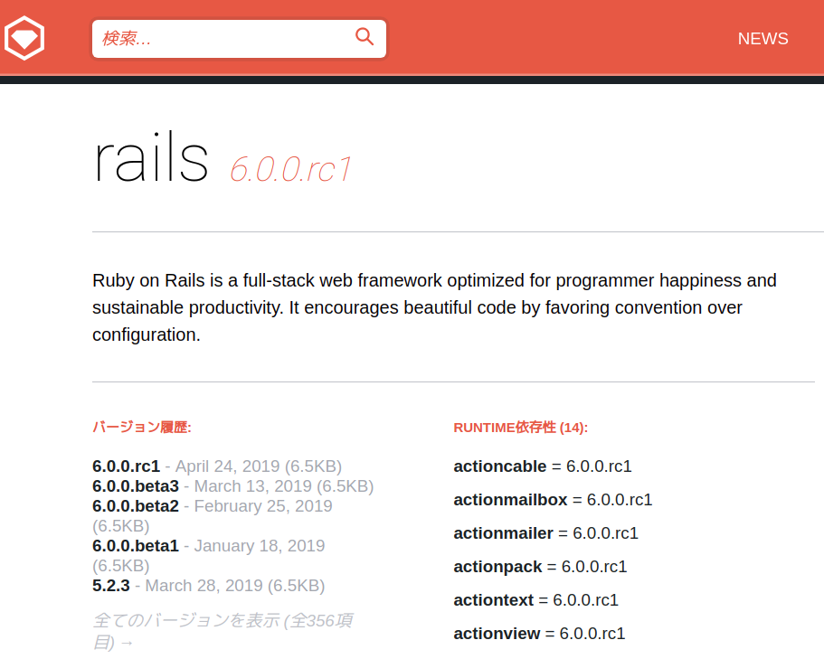
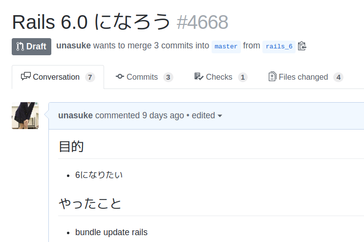
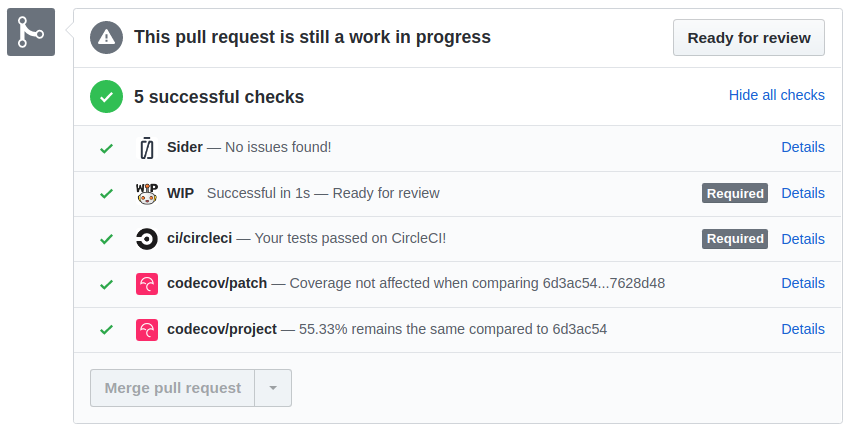
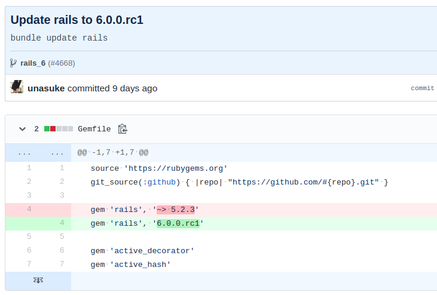
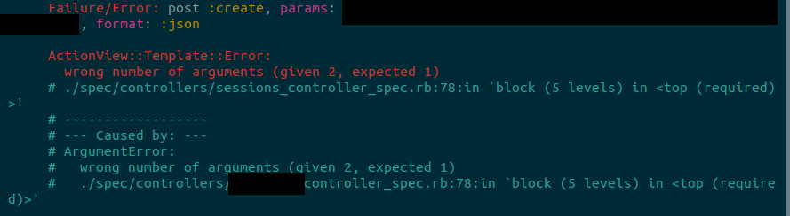
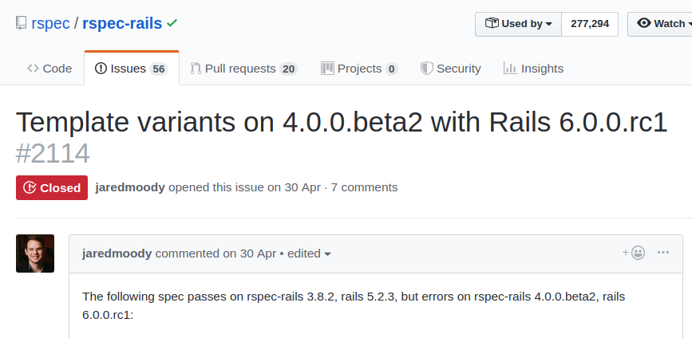
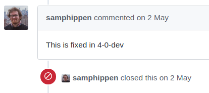
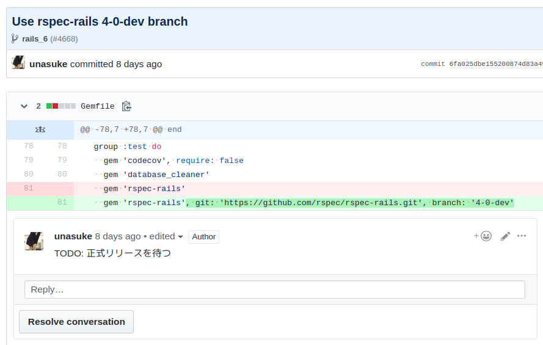
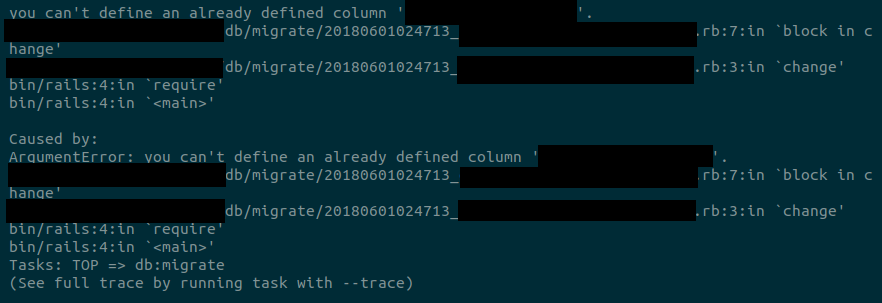
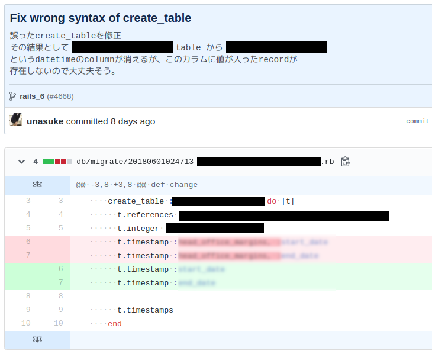

# CASHとRails 6.0.0.rc1
subtitle
: 2019-07-18

subtitle
: 平成.rb #8

author
: うなすけ

theme
: unasuke-white

# 自己紹介
- 名前 : うなすけ
- 仕事 : 株式会社バンク (エンジニア)
  - インフラ寄りサーバーサイドエンジニア
  - Ruby, Rails, Kubernetes...

- {::tag name="x-small"}GitHub [@unasuke](https://github.com/unasuke){:/tag}
- {::tag name="x-small"}Mastodon [@unasuke@mstdn.unasuke.com](https://mstdn.unasuke.com/@unasuke){:/tag}
- {::tag name="x-small"}Twitter [@yu\_suke1994](https://twitter.com/yu_suke1994){:/tag}

{:relative_width="24" align="right" relative_margin_right="-10" relative_margin_top="42"}

# Rails 6.0.0.rc1
{:relative_width="100"}

# Draft pull req つくった
{:relative_width="100"}

# 3 commits で test pass
{:relative_width="100"}

# Gemfile
{:relative_width="100"}

# テストが落ちる
{:relative_width="100"}

- `format: :json` がダメ？🤔🤔
  - でもCANGELOGにそれっぽいのはない……

# 公式を見る
{:relative_width="100"}

<https://github.com/rspec/rspec-rails/issues/2114>

# 公式を見る
{:relative_width="100"}

<https://github.com/rspec/rspec-rails/issues/2114>

# rspec-rails 4-0-dev branchを使う
{:relative_width="100"}

# migrationが落ちる
{:relative_width="100"}

# migrationのsyntaxがおかしかった
{:relative_width="90"}
